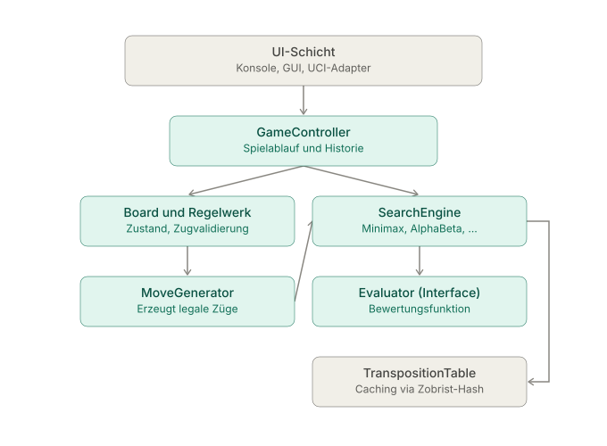

# Design of the Chess-Engine
(Diagram in German)

# Header Overview

Pure class declarations according to the architecture described above.

| File | Responsibility |
|---|---|
| `Types.h` | Basic types: `Color`, `PieceType`, `Square`, `GameResult`, Castling rights |
| `Move.h` | Lightweight move value type including special cases (Castling, En passant, Promotion) |
| `Board.h` | Position, `makeMove`/`undoMove`, Check/result queries, FEN |
| `MoveGenerator.h` | Pseudo-legal and legal move generation |
| `Evaluator.h` / `MaterialEvaluator.h` / `PositionalEvaluator.h` | Interchangeable evaluation functions (Strategy Pattern) |
| `TranspositionTable.h` | Zobrist Hash cache for previously calculated positions |
| `SearchEngine.h` / `MinimaxSearch.h` / `AlphaBetaSearch.h` / `IterativeDeepeningSearch.h` | Interchangeable search algorithms (Strategy Pattern) |
| `Player.h` | Abstracts Human vs. Engine as a source of moves |
| `UserInterface.h` | Decouples display (Console/GUI/UCI) from the rest |
| `GameController.h` | Orchestrates game flow, history, and turn switching |

## Dependency Direction

```
UserInterface  <---  GameController  --->  Player (Human/Engine)
                          |                     |
                          v                     v
                        Board  <---  MoveGenerator
                                          ^
                                          |
                                   SearchEngine ---> Evaluator
                                          |
                                          v
                                TranspositionTable (optional)
```
